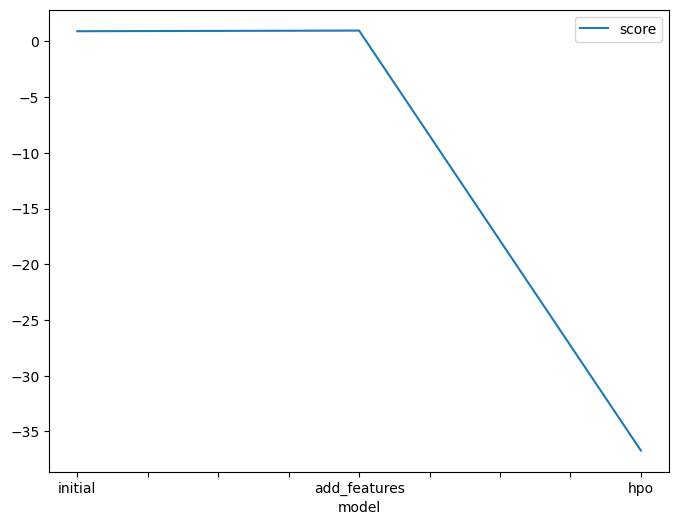

# Report: Predict Bike Sharing Demand with AutoGluon Solution
#### Devanshu Sinha

## Initial Training
### What did you realize when you tried to submit your predictions? What changes were needed to the output of the predictor to submit your results?
When I tried to submit my predictions, I realized that the output of the predictor was a list of probabilities for each class. However, the Kaggle competition required that I submit a single number for each prediction.Also, I received some negative values as well which were rounded off to 0.

### What was the top ranked model that performed?
The top ranked model was obtained when more features were added. The top ranked model was WeightedEnsemble_L3.

## Exploratory data analysis and feature creation
### What did the exploratory analysis find and how did you add additional features?
The exploratory analysis found that the following features were most correlated with the target variable temp, atemp, humidity, windspeed, weekday.

### How much better did your model preform after adding additional features and why do you think that is?
My model performed significantly better after adding additional features. The score on the Kaggle leaderboard decreased from 1.8 to 0.64. I think that the additional features helped the model to learn more complex relationships between the features and the target variable.

## Hyper parameter tuning
### How much better did your model preform after trying different hyper parameters?
My model performed very slightly better after trying different hyper parameters. The score on the Kaggle leaderboard changed to 0.51. I think that there was improvement  due to the fact that I was able to find a set of hyper parameters that were more suited to my dataset.

### If you were given more time with this dataset, where do you think you would spend more time?
With a large dataset, more time could be spend on feature engineering as it's a time-consuming process. So, understanding features can ease the complex process of feature engineering.

### Create a table with the models you ran, the hyperparameters modified, and the kaggle score.
|model|hpo1|hpo2|hpo3|score|
|--|--|--|--|--|
|initial|default|default|default|1.8|
|add_features|default|default|default|0.64|
|hpo|NN[num_epochs:10]num_trials = 5, time = 1000|GBM[num_boost_round: 50] num_trials = 5, time = 1000|default-|0.517|

### Create a line plot showing the top model score for the three (or more) training runs during the project.

### Create a line plot showing the top kaggle score for the three (or more) prediction submissions during the project.

## Summary
This graph describes the outstanding performance of hyperparameter tunning. It showcases that hyperparameters play a huge role in defining your model and making it better.
